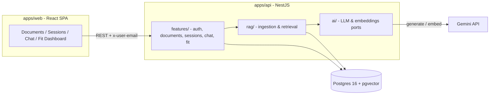
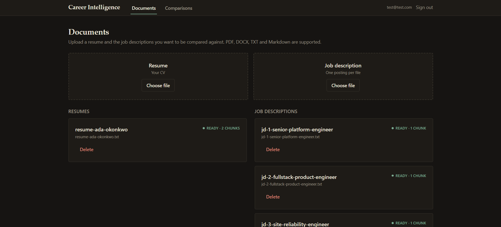
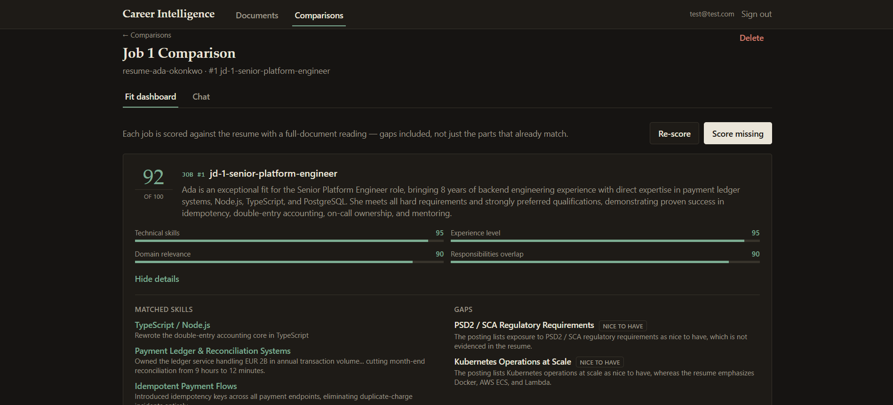
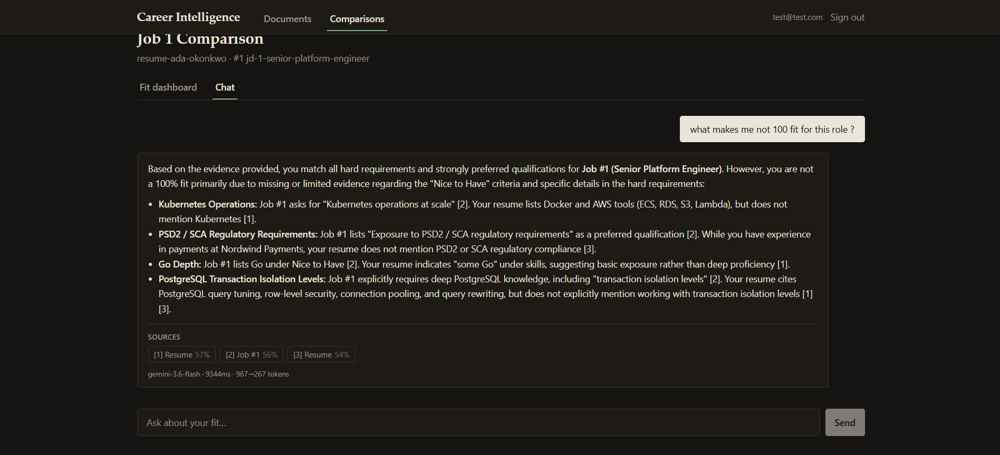
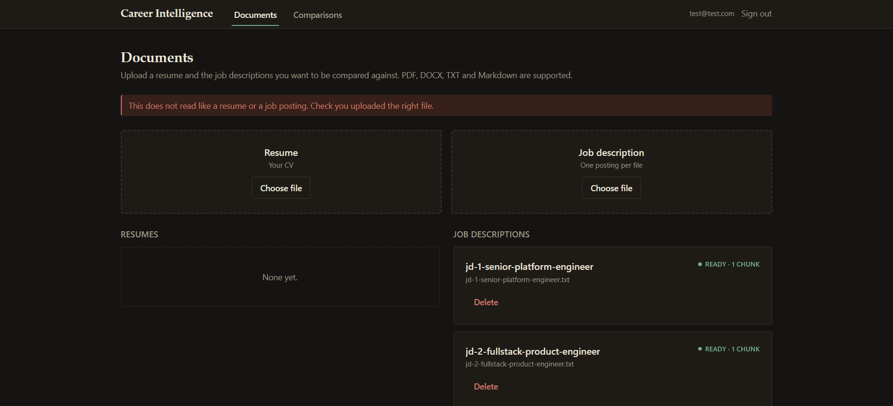

# Career Intelligence Assistant

A fullstack RAG application (Assignment **Option 4**): upload a resume and multiple job descriptions, then ask questions about fit, skill gaps, experience alignment, and interview preparation - with every answer grounded in, and cited against, the uploaded documents.

Beyond chat, each session has a **Fit Dashboard**: a structured, schema-constrained analysis of the resume against every job in the session (overall score, per-dimension scores with rationale, matched skills with evidence, gaps with severity, interview talking points).

## Tech stack

| Layer      | Choice                                                         |
| ---------- | -------------------------------------------------------------- |
| Frontend   | React 19 + Vite + Tailwind CSS 4, react-router, react-markdown |
| Backend    | NestJS 11 (TypeScript, Node 22)                                |
| Database   | PostgreSQL 16 + **pgvector** (HNSW index), Prisma 7            |
| LLM        | Google Gemini (`gemini-3.6-flash` by default)                  |
| Embeddings | `gemini-embedding-001`, 768 dimensions, L2-normalised          |
| Monorepo   | pnpm workspaces (`apps/api`, `apps/web`)                       |

## Quick setup

Prerequisites: Docker. (For the development path also Node ≥ 22 and pnpm 10.)

Either way, first get a free Gemini API key from [aistudio.google.com/apikey](https://aistudio.google.com/apikey) and configure it:

```bash
cp apps/api/.env.example apps/api/.env
# set GEMINI_API_KEY in apps/api/.env
```

### Option A - everything in Docker

```bash
docker compose up --build
```

That's the whole stack: Postgres + pgvector, the API (which applies its own migrations on boot), and the production frontend build served by nginx.

- Web: http://localhost:8080
- API: http://localhost:3000 - health check at `GET /health`

If something already holds port 3000, the host ports are overridable. Both variables must agree, because the API URL is compiled _into_ the frontend bundle:

```bash
API_PORT=3001 API_URL=http://localhost:3001 docker compose up --build
```

### Option B - database in Docker, apps on the host (hot reload)

```bash
pnpm install
docker compose up -d db          # just Postgres, on localhost:5433
pnpm --filter @cia/api prisma:generate
pnpm --filter @cia/api migrate:deploy
pnpm dev
```

- Web: http://localhost:5173
- API: http://localhost:3000

Sign in with any email (no password - see [Auth is deliberately thin](#auth-is-deliberately-thin)), upload a resume and a few job descriptions (PDF, DOCX, TXT, or Markdown - sample files live in [samples/](samples/)), create a session, and ask away.

### Tests and linters

```bash
pnpm test                            # unit tests (41)
pnpm --filter @cia/api test:e2e      # end-to-end (10) - needs the database up
pnpm lint
```

The e2e suite substitutes fakes for the two AI ports, so it exercises the entire pipeline - upload, chunking, pgvector search, citations, fit scoring, tenant isolation - without an API key or a single token of quota.

## Architecture overview



The API is layered so that dependencies point one way: `features` (HTTP-facing use-cases) → `rag` (ingestion and retrieval logic) → `ai` (provider adapters). `LlmService` and `EmbeddingsService` are abstract ports with Gemini implementations behind them - swapping providers means writing one new adapter, not touching the RAG or feature code.

**Ingestion path:** upload → text extraction (pdf-parse / mammoth / plain text) → whitespace normalisation → paragraph-aware chunking → batched embeddings → transactional insert into pgvector. Processing is async: the document row tracks `PENDING → PROCESSING → READY | FAILED` and the UI polls the status, so a slow embed never blocks the upload request.

**Query path:** question → conversational rewrite into a standalone query → embed → cosine search (HNSW) scoped to the session's documents and the current user → relevance floor + token budget → labelled evidence blocks → grounded answer with `[n]` citations, persisted with rank and score.

## RAG / LLM approach & decisions

### Model & infrastructure choices

- **LLM - Gemini Flash.** I considered OpenAI (`gpt-4o-mini`) and Anthropic (Haiku). Gemini won on practical grounds for a take-home: a genuinely free tier that covers both chat _and_ embeddings with one key and one SDK, solid structured-output support (used for the fit analysis), and quality that is more than enough for grounded Q&A where the prompt does the heavy lifting. The abstract `LlmService` port keeps this a config decision, not an architectural one.
- **Embeddings - `gemini-embedding-001` at 768 dimensions.** The model supports Matryoshka truncation; 768 dims is the sweet spot of quality vs. index size for this corpus (a handful of documents per user, not millions). Truncated vectors must be re-normalised - the adapter does this explicitly. Each chunk records which model embedded it, so a future model switch is a re-embed migration instead of a silent wipe (cosine similarity between two different models' vectors returns a number that means nothing).
- **Vector database - pgvector, not a dedicated vector store.** I considered Pinecone, Qdrant, and Chroma. Postgres already holds users, documents, sessions, and messages; putting vectors in the same database means chunk inserts are transactional with document status updates, tenant isolation is a `WHERE user_id = ...` clause on a JOIN rather than a metadata-filter convention, and there is one system to run, back up, and deploy. At this scale a dedicated store adds an operational dependency and a consistency problem while solving a performance problem I don't have. An HNSW index (`vector_cosine_ops`) keeps search fast if it grows.
- **Orchestration - none.** I considered LangChain and LlamaIndex and decided against them. The pipeline here is short and linear (rewrite → embed → search → prompt → generate), and owning those ~200 lines means every prompt, retry, and token budget is explicit and debuggable rather than buried behind a framework abstraction. Frameworks earn their keep when you need agents, tool routing, or many interchangeable backends; this project doesn't.

### Chunking

Paragraph-first with sentence-level fallback ([chunking.service.ts](apps/api/src/rag/ingestion/chunking.service.ts)): split on blank lines, pack paragraphs up to a ~300-token target with a ~60-token overlap carried between chunks, and only split inside a paragraph when it alone exceeds 1.5× the target. Resumes and job descriptions are naturally sectioned documents - bullets, headings, short paragraphs - so paragraph boundaries are the semantic boundaries, and 300 tokens keeps a chunk to roughly one resume section or one requirements block. Token counts are estimated at ~4 chars/token; for budgeting (not billing) that accuracy is sufficient and avoids shipping a tokenizer. PDF extraction output is normalised first (hard-wrapped lines, column-layout spaces, form feeds) so chunk boundaries are predictable.

### Retrieval

- **Conversational query rewrite.** Retrieval embeds the question alone, with no history attached - so "what about the second one?" embeds to noise. A cheap low-temperature LLM call first rewrites the follow-up into a standalone question; if the rewrite fails, the raw question is used rather than failing the request.
- **Scoping to named jobs.** Every job posting in a session is semantically close to every other, so "how do I fit Job #1?" would happily retrieve chunks from Job #3. When a question names `Job #N`, retrieval is narrowed to those documents plus the resume; unnamed questions stay session-wide because cross-job comparison is a legitimate ask. The rewrite prompt is instructed to preserve `Job #N` labels verbatim so this works on follow-ups too.
- **Top-K 8, relevance floor 0.35, context budget 6,000 tokens.** The budget keeps the prompt focused rather than stuffing everything retrieved into it. The floor is a cost guard on genuinely empty retrieval, and it fires rarely: measured against this corpus, an off-topic question ("what colour is my shirt?") still scores ~0.50 against a resume, while an on-topic one scores ~0.57. Gemini embeddings put unrelated English text at a high baseline, so an absolute cosine threshold is a blunt instrument for "is this on topic" - the margin is too narrow to threshold on without risking false refusals, which are a worse failure than a wasted call. Honest "I don't know" answers come from the prompt, not from this number.
- **Labelled evidence, persisted citations.** Each context block is numbered and labelled in the user's own vocabulary ("Job #2 - «Senior Platform Engineer»"), and every assistant message stores its citations with rank and score, so the UI can show exactly which chunk backs which claim - and so retrieval quality can be audited after the fact.

### Prompt & context management

Prompts live in one reviewable file per feature ([chat/prompts.ts](apps/api/src/features/chat/prompts.ts), [fit/fit.schema.ts](apps/api/src/features/fit/fit.schema.ts)), not scattered through service code. Chat history is windowed to the last 10 turns. The fit analysis deliberately does **not** use retrieval: it sends both full documents (truncated at 24k chars), because "score this resume against this job" needs the whole of both texts, not the nearest chunks - using RAG where it fits and skipping it where it doesn't.

### Guardrails

- **Grounding rules in the system prompt**, tuned for this domain's specific failure: a career assistant that embellishes a resume is worse than one that says "I don't know", because the user may repeat the invention in an interview. Every claim must cite evidence; the model is told to distinguish "the resume does not mention X" from "the candidate lacks X".
- **No-evidence short-circuit:** if retrieval comes back empty - no documents attached, or nothing above the floor - a canned answer is returned _without calling the model at all_, because with no evidence a generation could only be invention. In practice the empty-session case is what triggers this; see the floor's calibration above for why an off-topic question usually still clears it and is refused by the prompt instead.
- **Low temperature** (0.2 for answers, 0.1 for scoring): creative variation reads as invented experience.
- **Schema-constrained JSON** for the fit analysis (Gemini `responseSchema`) plus a server-side validator on the parsed result - the model cannot return a malformed or out-of-range breakdown into the database.
- **Input hygiene:** global `ValidationPipe` with whitelisting, file-type and extracted-text checks (a scanned PDF with no text layer fails with an actionable message), env validation at bootstrap that names every bad variable at once. The frontend pre-checks extension and size so a wrong file fails instantly instead of after a 10 MB round trip; the server re-checks regardless.
- **Document classification at ingest** ([document-classifier.service.ts](apps/api/src/rag/ingestion/document-classifier.service.ts)): before anything is stored or embedded, the extracted text is scored against weighted structural signals for each kind - dated employment ranges and education headings for a resume; "we are looking for", "you will", requirements blocks for a posting. Upload a job posting under _Resume_ and it says so; upload a bank statement and it is rejected outright. Heuristics rather than an LLM call, because an upload should not spend generation quota, and because a deterministic rule is testable. Calibrated against the files in [samples/](samples/): real documents score 16–22, non-documents score 0.

  The first version of this had a bug worth recording. It counted an email address and a phone number as resume evidence, so a real bank statement passed on the strength of the _bank's own_ support contacts - enough letterhead to clear the threshold with nothing resembling a career history. Signals are now split into structural and incidental, and only structural evidence opens the gate. Contact details prove a document has a sender, not that it describes a person's work.

- **Tenant isolation** enforced in SQL: every chunk search JOINs documents and filters on `user_id`; every service method resolves ownership before touching data.

### Quality & observability

**Tests - 41 unit, 10 end-to-end.** Unit tests target the intricate, pure logic: chunking boundaries and overlap, the retrieval relevance floor and token budget, `Job #N` scope resolution, and the document classifier. The chunks repository is tested against a _real_ Postgres rather than a mock, because the thing under test is hand-written SQL - a mock would only assert that the string I wrote is the string I wrote. Its most important case is adversarial: search as user A using the exact embedding of user B's chunk, and assert B's data never appears.

The e2e suite is where the port abstraction pays off. Nest's testing module swaps `LlmService` and `EmbeddingsService` for deterministic fakes (a word-bag embedding that produces realistic cosine behaviour, a canned generator), so the full pipeline - multer, extraction, classification, chunking, pgvector search, citation persistence, fit caching, cross-tenant 404s - runs over real HTTP against a real database, with no API key and no quota spent.

That suite earned its keep on its first run: it caught a real bug where the user's message was persisted _before_ the conversation history was read, so "prior turns" always included the question being asked. The rewrite step was firing on the first message of every session, spending an extra generation to rewrite a question against itself.

**Observability.**

- Every assistant message persists **model, prompt/completion tokens, and latency** - cost and performance are queryable per message, per session, per user, and surfaced in the UI.
- One line per HTTP request (method, path, status, duration) via a global interceptor; 4xx logs as a warning, 5xx as an error, because one is the client's problem and the other is mine.
- One line per retrieval: `retrieval k=8 kept=3 top=0.567 floor=0.35`. This is the tuning signal for the whole RAG loop - a falling top score means embeddings or chunking drifted, and `kept=0` explains exactly why the assistant said it didn't know. Query text is deliberately not logged.
- Structured Nest logging elsewhere: query rewrites, retrieval scoping, per-document indexing time, retry attempts, rejected uploads with their scores.
- Shared retry policy (exponential backoff on 429/5xx/network errors) for both AI clients - extracted because the same loop copy-pasted twice will drift twice. Full provider errors go to the logs; the client gets one clean sentence (provider payloads are hostile as UI copy and occasionally leak project ids).
- `GET /health` does a real `SELECT 1` - a process that answers 200 while Postgres is down is worse than no health check, because an orchestrator will route traffic to it.

## Key technical decisions

1. **Postgres as the only stateful service.** Vectors, relational data, and chat history in one transactional store. See the vector-database reasoning above; it's the single decision that most simplified everything else.
2. **Ports for AI providers.** `LlmService` / `EmbeddingsService` abstract classes with Gemini adapters. The rest of the codebase speaks in neutral terms (roles `user`/`assistant`, plain vectors); the adapter translates Gemini's quirks (e.g. its `model` role) at the edge.
3. **Async ingestion with an explicit status machine.** Upload returns immediately; embedding happens in the background with `PENDING/PROCESSING/READY/FAILED` on the row, the error message stored, and a reprocess endpoint. For this scale a fire-and-forget promise is enough - a real queue is the documented production upgrade, not a day-one need.
4. **Sessions as the unit of context.** A session pins one resume and N labelled jobs. Labels (`Job #1`, `Job #2`) are stable, stored, and flow through prompts, retrieval scoping, and citations - the whole app speaks the user's vocabulary.
5. **Fit analysis cached per (resume, job) pair** with an explicit refresh - an LLM analysis of two unchanged documents is deterministic enough to reuse and too expensive to recompute on every page load.
6. **Feature-first module layout** (`features/` vs `rag/` vs `ai/`) so the domain logic, the RAG machinery, and the provider glue can each change without rippling into the others.

### Auth is deliberately thin

Sign-in is email-only and requests carry an `x-user-email` header. This is **identification, not authentication** - it exists to demonstrate real multi-tenant data isolation (which is enforced everywhere, down to the SQL) without spending assignment time on password storage or OAuth plumbing. The guard is one class; swapping it for real JWT/OIDC auth changes no feature code. This is the first thing I'd replace for production.

## Productionizing (AWS as the example - maps 1:1 to GCP/Azure)

What exists already helps: the API is stateless (scales horizontally), config is env-driven and validated at boot, migrations are versioned, and the health check is orchestrator-grade.

**Minimum viable production:**

- **Compute:** both apps are already containerised - the API image runs `prisma migrate deploy` on boot, the web image is nginx serving the Vite build. Deploy the API to ECS Fargate behind an ALB pointed at `/health`; the web image can go to Fargate too, or skip it and put the static `dist/` on S3 + CloudFront. Note that `VITE_API_URL` is baked into the bundle at build time, so each environment needs its own web image (or a runtime-config shim).

  One constraint that rules out a whole class of hosting: the API **cannot** go on a serverless runtime as-is. Ingestion is fire-and-forget work inside the API process, and serverless freezes the process once the response is sent - documents would sit in `PROCESSING` forever. Either keep a long-running container, or move ingestion to a queue first (below). This is also why the frontend is the only half that suits Vercel-style hosting.

- **Database:** RDS for PostgreSQL (pgvector is supported on RDS/Aurora, Cloud SQL, and Azure Flexible Server) with automated backups; PgBouncer/RDS Proxy for connection pooling under Fargate scale-out.
- **Secrets:** move `GEMINI_API_KEY`/`DATABASE_URL` to Secrets Manager, injected as env at task start.
- **Auth:** replace the header guard with Cognito/OIDC-issued JWTs (single class swap, per the design above).
- **Ingestion:** replace the in-process background promise with SQS + a worker service, and store original uploads in S3. This adds retries with dead-lettering and lets ingestion scale independently of the API.

**Then, in order of value:**

- **Observability:** OpenTelemetry traces across the request → rewrite → retrieval → generation chain, dashboards on the token/latency data already being persisted, alerting on FAILED-document rate and provider 429s.
- **Cost & abuse control:** per-user rate limits and daily token budgets (the per-message token accounting to enforce this already exists), upload size/count quotas.
- **Scale of retrieval:** the HNSW index is already in place; at real scale, tune `ef_search`, and consider partitioning chunks by user.
- **CI/CD:** GitHub Actions running lint + tests + `prisma migrate diff` on PR, image build and deploy on merge.

## Engineering standards

**Followed:**

- Strict TypeScript everywhere; DTO validation with a whitelisting global pipe; env validation at bootstrap.
- One-way layering with dependency inversion at the AI boundary; prompts as reviewed code, not string literals inline.
- Versioned SQL migrations (including hand-written parts Prisma can't express: `CREATE EXTENSION vector`, the HNSW index) with comments explaining _why_ they're hand-written.
- Unit tests on the intricate pure logic, plus an e2e suite that runs the real pipeline against fake AI adapters; comments reserved for the _why_ (the failure mode a piece of code buys out of), not the _what_.
- Server state on the frontend handled by TanStack Query rather than hand-rolled `useEffect` fetch triples - one hook per resource, mutations invalidating cache keys, so no page owns loading/error state or leaks a request on unmount.
- Conventional, reviewable commits; ESLint + Prettier (API) and oxlint (web); the whole stack containerised, with a healthcheck gating startup order.

**Consciously skipped (time-boxed, not forgotten):**

- Real authentication (see above - the seam for it is in place).
- Streaming responses (SSE) - answers arrive whole; the UI shows a thinking state.
- Frontend component tests. The backend has unit and e2e coverage; the UI is verified by hand.
- Rate limiting and request quotas.
- A RAG evaluation harness (golden Q&A set scored for retrieval hit-rate and faithfulness).
- Generated API types. `apps/web/src/lib/types.ts` mirrors the server's response shapes by hand - the right answer at ~15 endpoints, and a code generator the moment there are more.

## How I used AI tools

I used **Claude Code** as the primary assistant throughout, in a deliberately structured way:

- **I owned the architecture, the AI drafted within it.** Layering (`features`/`rag`/`ai`), the port-adapter boundary, the session/label model, and the retrieval strategy were decided first and stated explicitly in prompts; the assistant filled in implementations inside those constraints. When generated code crossed a boundary (e.g. provider details leaking above the adapter), I pushed it back rather than accepting the shortcut.
- **Working in reviewable slices.** One feature per session/commit (ingestion pipeline, then RAG chat + tenant isolation, then FE wiring, then refactors), each reviewed as a diff before committing - never "generate the whole app".
- **Refactoring passes as separate steps.** Two dedicated refactor commits (env validation + ports + shared retry; the ai/rag/features restructure) where the goal was purely to make earlier AI-assisted code match my standards, which is how I keep AI output _maintainable_ rather than just _working_.
- **Do's and don'ts I follow:** do make the AI explain trade-offs before writing code; do have it write the fiddly-but-testable parts (chunking, SQL building) _with_ tests; do use it for boilerplate (DTOs, wiring, Tailwind). Don't let it choose the architecture or data model unsupervised; don't accept comments that narrate the code instead of justifying it; don't trust generated claims about provider APIs without checking docs; and don't put an LLM's voice in documents that are supposed to contain my judgement - this README included: the decisions and reasoning are mine, with AI used to help check it against the codebase.

## What I'd build next

What exists is an MVP: it works end to end, the flow is intuitive without explanation, and - the part I care most about - tenant separation is real and enforced in SQL rather than assumed. That last one was a deliberate early investment, because retrofitting isolation into a system that didn't have it is how data leaks happen.

In priority order:

1. **A real authentication flow.** Today's email header is identification, not authentication - anyone who knows an address can act as that user. The isolation _mechanism_ is already correct and tested; what's missing is proving the caller is who they claim. Sessions or OIDC-issued JWTs, replacing one guard class. This is the gap between a demo and something I would let a real person upload their CV to.
2. **Monetisation: free trial, then plans or credits.** Every call to a model costs money, and the per-message token accounting needed to meter it is already being persisted. That makes usage-based credits a natural fit: a trial allowance, then plans, with quotas enforced from data the app already records.
3. **A structured evaluation of other LLMs.** The current model was picked on practical grounds (free tier, one SDK for chat and embeddings) rather than measured quality. With a golden set of questions and expected sources, I would compare models on faithfulness, citation accuracy, and cost per session - the port abstraction means each candidate is a config change, so the work is in the evaluation harness, not the integration.
4. **Streaming answers** (SSE) - the biggest single UX win; latency is dominated by generation.
5. **Hybrid retrieval**: BM25/`tsvector` fused with vector search (reciprocal rank fusion). Resumes are full of exact tokens - skill names, tool versions - where lexical search beats embeddings.
6. **Real background jobs** (BullMQ or SQS) for ingestion instead of the in-process promise.

## Known limitations

- No real authentication (by design, documented above).
- Documents are stored as extracted text; original files are not retained.
- Token counts for budgeting are estimates (~4 chars/token), not tokenizer-exact.
- Free-tier Gemini quota is **per day and per model** (20 generations/day). A chat turn can cost two (rewrite + answer). Limits surface as a friendly 503 with retry guidance, but there is no client-side queueing; switching `GEMINI_CHAT_MODEL` gives a fresh allowance.
- English-only. The prompt rules and, more sharply, the document classifier's signals are English - a German CV would score zero and be rejected at upload. Multilingual signals or an LLM fallback when the heuristic finds nothing is the fix.
- The document classifier is heuristic. It reliably separates the documents it was calibrated against, but an unconventional CV (no dates, no education section) could be refused; the thresholds deliberately err toward accepting.

## Screenshots

### Documents

Upload a resume and any number of job descriptions. Ingestion is asynchronous, so rows move through `PENDING → PROCESSING → READY` with a live chunk count; a wrong file is rejected before anything is stored.



### Fit dashboard

Every job in the session scored against the resume: overall score, four fixed dimensions, matched skills with evidence, and gaps weighted by how the posting itself framed them.



### Cited chat

Answers are grounded in retrieved chunks. The `[n]` markers in the text line up with the sources below it, and each source expands to the exact passage and its similarity score.



### Guardrails

Two different checks, at two different points in the pipeline.

**At upload** — the extracted text is scored before anything is stored or embedded, so a file that is not what it claims to be never enters the index:


